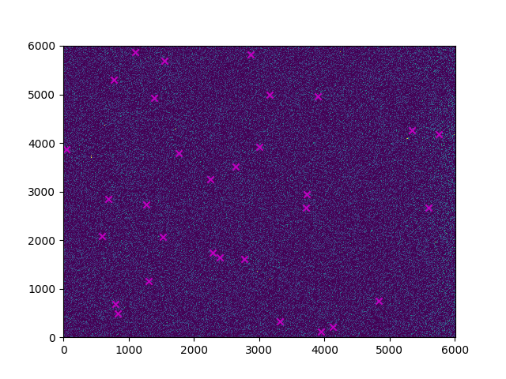
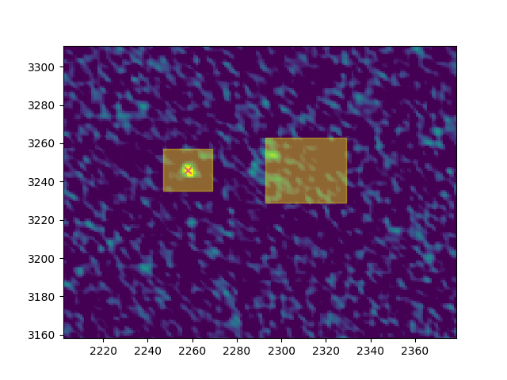
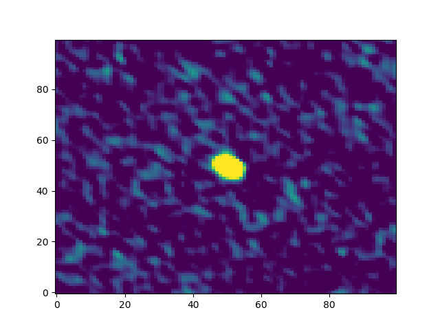

# Reading and plotting FITS images

*Note: The headers of the tt0 and tt1 images are exactly the same.
I would have thought that the tt1 image should be a reference image
at a different frequency, so I'm assuming that tt0 is at 3 GHz as
stated in the header, and that tt1 is at 3 GHz + 2.07 GHz 
(i.e. CRVAL3 + CDELT3 values from the header)*

The python script `looker.py` reads the CSV file with the `--csv_in` flag
and the tt0 and tt1 FITS images as `--fitsA` and `--fitsB`. 
With the `--plot` flag the script will show the tt0 image with crosses
that mark where the catalogue sources are. Adding the `--plotareas` flag
will also show areas around the source and close to the source that
are used to find the peak pixel flux value and background 
level, respectively. 
The `--sourceplots` flag will show a plot for each source 
that shows a cut-out area of the image centered on the source.

The script also outputs a csv file consisting of 8 columns:

RA and DEC

Peak pixel flux of source (mJy/beam) as measured from the image

Peak flux source (mJy/beam) as listed in the catalogue

The difference between the image and catalogue flux densities

The spectral index (gamma) of each source (where applicable)

Whether or not the catalogue source is visible in the image

*The visibility was determined from whether or not the source
S/N was greater than 5*

*The spectral index is calculated by taking the log10 of S=f^gamma
and finding the slope between two points (i.e. the S and f of the 
same pixel on tt0 and tt1). This was problematic though, as the
majority of sources are not visible in the tt1 images. So when
an S/N above 5 is obtained from tt1, the gamma is calculated,
otherwise "NaN" is returned* 

# Improvements

Add location/size selector of background area and add boundary conditions.

Add 2D gaussian fit to each source to calculate total flux density.

Compare 2D gaussian to beam size to decide whether the source is
resolved or unresolved.

# Plot examples

```
python looker.py --csv_in <CSV> --fitsA <tt0> --fitsB <tt1> --plot
```
gives full image with 'x' marking the location of each source:



```
python looker.py --csv_in <CSV> --fitsA <tt0> --fitsB <tt1> --plot --plotareas
```
gives the same plot, but if we zoom-in on sources we can see the areas
chosen to find the peak pixel value and background:



```
python looker.py --csv_in <CSV> --fitsA <tt0> --fitsB <tt1> --sourceplots
```
gives a cut-out plot centered on each source:


